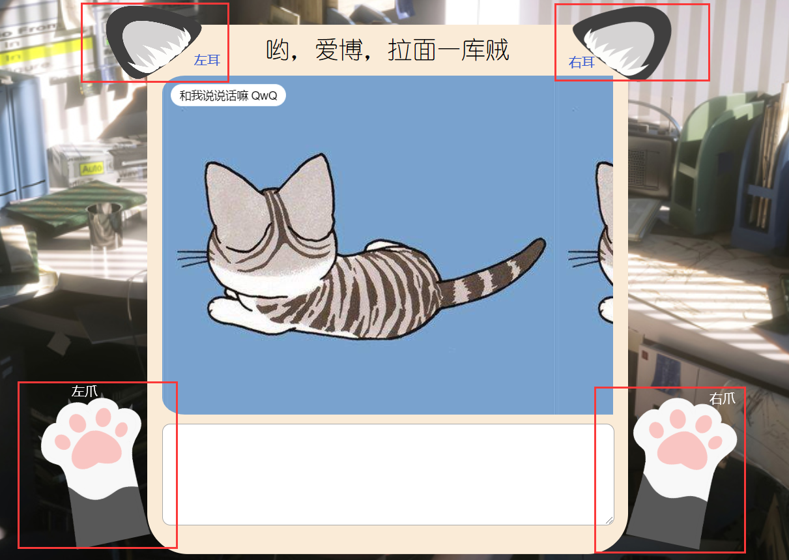
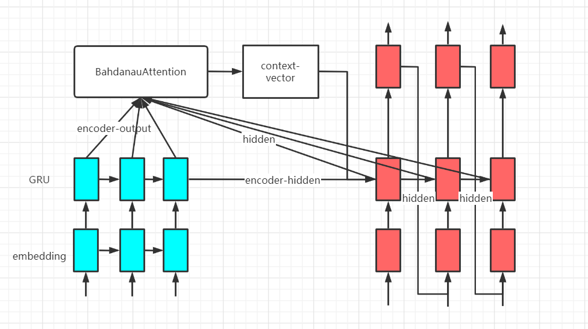
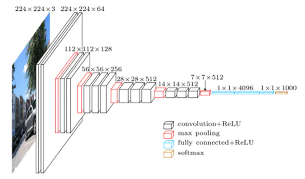
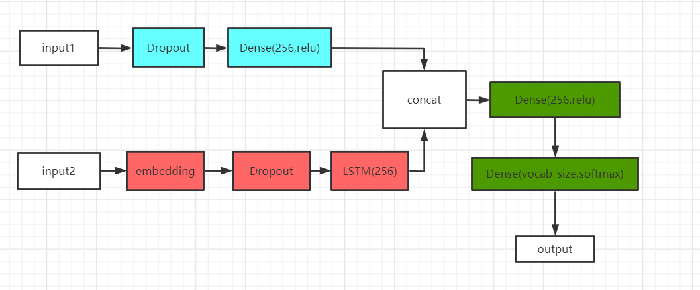
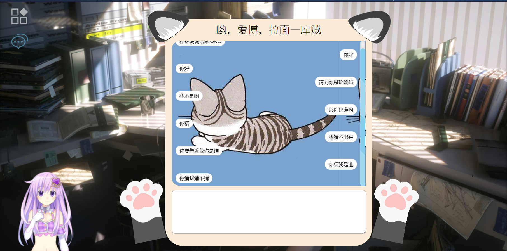

# ChatBot
对话机器人，包含了看图说话，单轮对话和多轮对话，使用tensorflow 2.0 pytorch 1.3.1 GPT-2
### 开发环境
    - flask==1.0.2
    - tensorflow==2.0.0
    - pytorch==1.3.1
    - sklearn==0.19.2
    - scipy==1.4.1
    - numpy==1.18.5
    - jieba==0.42.1
    - pandas==0.23.4
    - torchvision==0.5.0
    - transformers==2.1.1  
- js文件  
    js和layui包放于/static目录下，layui可以到[官网](https://www.layui.com/)下载，详细目录结构参见文件目录  
    |  | | |
    |---|---|---|
    | js  |  [百度网盘:js](https://pan.baidu.com/s/1yXNrU-WmzDJ2mh7X0gna7Q)  | 提取码：c8ha  |
    | layui包 |  [百度网盘:layui](https://pan.baidu.com/s/1kGrqfHoD9wJQ3R2WNG-CCg)  | 提取码：ts1k  |
---
### 使用
- 启动前端，可以在pycharm中直接启动
- 启动app.py
- 回车或点击左爪发送消息，点击右爪发送图片，点击左耳切换图片描述和图片描述注入对话模型两种模式，点击右耳切换多轮对话和单轮对话模式  
  
---

### 单轮对话  
1. 采用小黄鸡作为对话语料，总共450000对话数据，不过有部分噪音和特殊符号
2. 利用pandas从xhj.csv中读入对话，第一列为问题，第二列为回答，分别将其分离到question和answer数组，并进行预处理，在每个句子前加上'start ',句子后加上' end'。xhj.csv已经用jieba分词处理过，但在预测时输入句子要进行jieba分词和预处理。
3. 模型采用seq2seq，encoder和decoder采用GRU网络，利用BahdanauAttention实现注意力机制。将input注入encoder获得encoder-output和encoder-hidden（decoder-hidden），然后将['start']作为decoder第一个input，和decoder-hidden，encoder-output注入decoder，将encoder-output和decoder-hidden注入BahdanauAttention获得注意力权重和context-vector；把input嵌入到对应维度，与context-vector连接起来然后输入到GRU，最后通过Dense层输出output和decoder-hidden，利用output和target(目标，即回答)，此时decoder的input为target[:, t]，重复decoder操作。
4. 预测：用jieba将句子分词后预处理，然后通过tokenizer获取编码，然后转化成张量。初始hidden为0矩阵，shape为[1, units]，同样以['start']作为第一个input注入decoder，获得output，取第一行最大值，通过tokenizer转换为词，重复直到句子的最大length结束，将这些词拼起来即为回答句子。
5. **运行dialog.py中train()开始训练，运行predict(sentence)调用模型进行预测。**  

---
<center>蓝色部分为encoder，红色为decoder</center>  

- |  | | |
    |---|---|---|
    | 模型  |  [百度网盘:model](https://pan.baidu.com/s/1PU5DXd2dpmn3hg5HwzGSlw)  | 提取码：d3i2  |
    | 数据集 |  [百度网盘:xhj](https://pan.baidu.com/s/1zodBfiw_wY9ZkWdSBOQZzA)  | 提取码：yf11  |

### 看图说话  
- **运行preprocess_img.py提取图片特征** 使用的是VGG16模型，提取后的特征存入features.pkl中。  


---
<center>提取最后一层1*1*1000</center>  

- 采用的是Flickr_8k中文数据集，**运行preprocess_text.py进行文本预处理**，去掉标点和多余的标识，进行结巴分词  
  
```
// 处理前
1000268201_693b08cb0e.jpg#zhb#0 穿着粉红色连衣裙的孩子爬上楼梯，进入一个入口。
1000268201_693b08cb0e.jpg#zhb#1 一个女孩走进一个木结构。
1000268201_693b08cb0e.jpg#zhb#2 一个小女孩爬进一个木制的剧场。
1000268201_693b08cb0e.jpg#zhb#3 一个小女孩爬楼梯到她的剧场。
1000268201_693b08cb0e.jpg#zhb#4 一个穿着粉红色连衣裙的小女孩走进一个木屋里。

// 处理后
1000268201_693b08cb0e	穿着 粉红色 连衣裙 的 孩子 爬 上 楼梯 进入 一个 入口
1000268201_693b08cb0e	一个 女孩 走进 一个 木结构
1000268201_693b08cb0e	一个 小女孩 爬进 一个 木制 的 剧场
1000268201_693b08cb0e	一个 小女孩 爬楼梯 到 她 的 剧场
1000268201_693b08cb0e	一个 穿着 粉红色 连衣裙 的 小女孩 走进 一个 木屋 里
```
- 通过图片标识区分句子描述的是哪一幅图片，数据集均为一幅图五个描述。
- 模型有两个输入，一个是图片的特征(input1)，一个是描述上文(input2)，标签为描述下文,将通过Dense层的input1与通过LSTM的input2组合，目的是让模型在识别图片的基础上学习说话，每个句子都是以['start']开始，以['end']结束。比如一个女孩走进一个木结构(如下表),相当于图片描述即作为x_train，也作为y_train。  
  
    | input2  | output  | label  |
    |---|---|---|
    | start 一个  | 女孩  | 女孩  |
    | start 一个 女孩 | 走进  | 走进  |
    | start 一个 女孩 走进  |  一个 | 一个 |
    | start 一个 女孩 走进 一个 |  木结构 | 木结构 |
    | start 一个 女孩 走进 一个 木结构 |  end | end |  
 

---  
- 预测：通过**see_evaluate.py中的predict_single**进行单张图片的描述，同样先用VGG16提取图片特征，然后与tokenizer一同注入训练好的模型得到描述。  

    |  | | |
    |---|---|---|
    | 数据集  |  [百度网盘:数据集](https://pan.baidu.com/s/1UOt0jDSE1hCrqEkaXWmZzQ)  | 提取码：jjbb  |
    | 模型 |  [百度网盘:模型](https://pan.baidu.com/s/1baZaCYUqw8acQDqry8QdcA)  | 提取码：oelm  |
    | Flickr_8k |  [百度网盘:图片](https://pan.baidu.com/s/11xjKSV8ykBko2IBgWFPLKg)  | 提取码：gluv  |
 
### GPT-2 多轮对话  
- 数据处理：基础数据集为50w的多轮闲聊数据集，在每一轮对话前加上[CLS]，在每个单对话后面加上[SEP]，之后利用BertTokenizer编码存到tokenizer.txt中。  
    ```
    // 原始语料
    加油，三月动起来，五月笑起来
    正解你为什么就那么厉害呢
    哈哈，没办法，智商就是这么高
    你这是要开始得瑟了吗！好啦！你最厉害！
    哈哈哈哈

    // 加入分割标志
    [CLS]加油，三月动起来，五月笑起来[SEP]
    正解你为什么就那么厉害呢[SEP]
    哈哈，没办法，智商就是这么高[SEP]
    你这是要开始得瑟了吗！好啦！你最厉害！[SEP]
    哈哈哈哈[SEP]
    
    // 通过BertTokenizer编码 101:[CLS] 102:[SEP]
    101 1217 3779 8024 676 3299 1220 6629 3341 8024 758 3299 5010 6629 3341 102 3633 6237 872 711 784 720 2218 6929 720 1326 2154 1450 102 1506 1506 8024 3766 1215 3791 8024 3255 1555 2218 3221 6821 720 7770 102 872 6821 3221 6206 2458 1993 2533 4449 749 1408 8013 1962 1568 8013 872 3297 1326 2154 8013 102 1506 1506 1506 1506 102 
    ```

- 训练：**run gpt_train.py --raw** 利用原始语料进行tokenizer然后训练模型，**run gpt_train.py --train_mmi** 训练MMI模型，指定超参数中**pretrained_model**表示在已有的模型进行训练，默认为空。 
- 预测：**predict.py中predict.py** 使用对话模型，**predict_mmi.py中predict.py** 使用MMI模型进行预测。history存储历史对话，默认存储最近5轮对话，可以在超参数中修改。
- MMI Model：MMI Model也是一个基于GPT2的生成模型，将每条训练数据进行"逆序"拼接,然后输入到网络中。该模型主要用于计算Dialogue Model生成的所有候选response相对于dialogue history的loss。训练时，将训练语料逆序拼接，同样通过BertTokenizer编码，作为MMI的输入进行训练。
    ```
    // 基础语料
    加油，三月动起来，五月笑起来
    正解你为什么就那么厉害呢
    哈哈，没办法，智商就是这么高
    你这是要开始得瑟了吗！好啦！你最厉害！
    哈哈哈哈

    // 逆序拼接
    [CLS]哈哈哈哈[SEP]
    你这是要开始得瑟了吗！好啦！你最厉害！[SEP]
    哈哈，没办法，智商就是这么高[SEP]
    正解你为什么就那么厉害呢[SEP]
    加油，三月动起来，五月笑起来[SEP]
    ```
- MMI response生成：
  - 假设当前history=["你好","你好呀","你在干什么？"]
  - 使用Dialog Model根据history生成n个候选response:["在看电视","我在上课啊","人家在想你啊","你猜"]
  - 使用MMI Model将每个候选response分别与history进行逆序拼接，如 "[CLS]在看电视[SEP]你在干什么[SEP]你好呀[SEP]你好[SEP]"
  - 输入到MMI Model中计算loss，选取loss最小的response作为最终回复  

 - 
      |  | | |
    |---|---|---|
    | 数据集  |  [百度网盘:50w闲聊数据集](https://pan.baidu.com/s/1eM8GAFIBGiZSs5QFKUiTMA)  | 提取码：y4ft  |
    | 模型 |  [百度网盘:dialog模型](https://pan.baidu.com/s/13P1NmDc8T8ep5UG-rBHOrQ)  | 提取码：wfwg  |
    | 模型 |  [百度网盘:MMI模型](https://pan.baidu.com/s/19rUmEq3dOwBFQg6JRwfZTw)  | 提取码：hnwd  |

### 效果展示  


### 参考资料  
- https://github.com/bixiuping1999/tf2-transformer-chatbot  
- https://github.com/bixiuping1999/GPT2-chitchat
- https://github.com/LeeWise9/Image_Captioning
- 《The Design and Implementation of XiaoIce, an Empathetic Social Chatbot》
- 《DIALOGPT: Large-Scale Generative Pre-training for Conversational Response Generation》
- 《Language Models are Few-Shot Learners》

### 文件目录  
```
│  .gitignore
│  app.py
│  README.md
│               
├─gpt_2
│  │  dataset.py
│  │  gpt_train.py
│  │  predict.py
│  │  predict_mmi.py
│  │  
│  ├─config
│  │      model_config_dialogue_small.json
│  │      
│  ├─data
│  │      interacting_mmi.log
│  │      train.txt
│  │      training.log
│  │      train_tokenized.txt
│  │      
│  ├─model
│  │      config.json
│  │      pytorch_model.bin
│  │
│  ├─mmi_model
│  │      config.json
│  │      pytorch_model.bin
│  │
│  ├─sample
│  │      samples.txt
│  │      
│  ├─tensorboard_summary
│  │      
│  ├─vocabulary
│  │      vocab_small.txt
│  │      
│  └─__pycache__
│          predict.cpython-37.pyc
│          
├─see_speak
│  │  load_func.py
│  │  preprocess_img.py
│  │  see_evaluate.py
│  │  see_hparam.py
│  │  see_train.py
│  │  
│  ├─data
│  │      features.pkl
│  │      Flickr_8k.testImages.txt
│  │      Flickr_8k.trainImages.txt
│  │      jieba_description.txt
│  │      tokenizer.pkl
│  │      
│  │      
│  └─_model
│  │      see_and_speak.h5
│          
├─single_chat
│  │  data.py
│  │  dialog.py
│  │  hparam.py
│  │  s2sModel.py
│  │  __init__.py
│  │  
│  ├─data
│  │      xhj.csv
│  │      
│  │      
│  └─model
│          
├─static
│  │  index.html
│  │  
│  ├─assets
│  │      autoload.js
│  │      flat-ui-icons-regular.eot
│  │      flat-ui-icons-regular.svg
│  │      flat-ui-icons-regular.ttf
│  │      flat-ui-icons-regular.woff
│  │      live2d.js
│  │      waifu-tips.js
│  │      waifu-tips.json
│  │      waifu.css
│  │      
│  ├─css
│  │      index.css
│  │      
│  ├─img
│  │      5.jpg
│  │      bg.jpg
│  │      catbtn.png
│  │      chatbg.jpg
│  │      ear.png
│  │      left.png
│  │      right.png
│  │      
│  ├─js
│  │      axios.js
│  │      jquery.js
│  │      main.js
│  │      vue.js
│  │      
│  └─layui
│                  
└─temp

```
