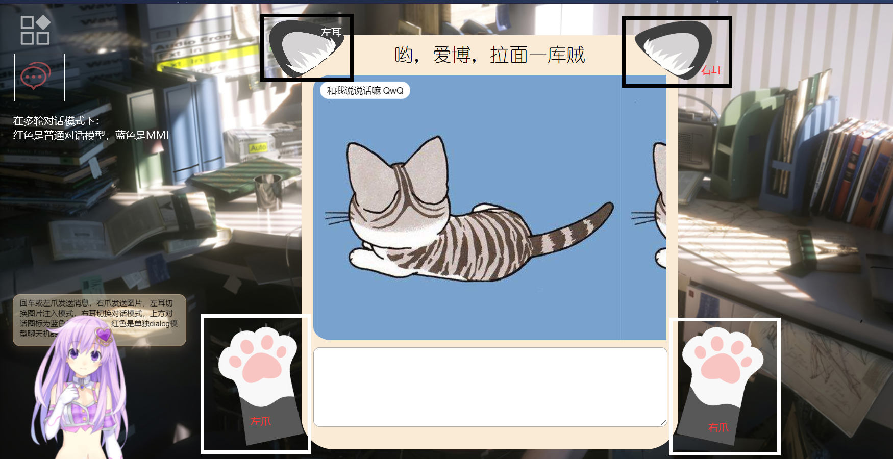

# ChatBot
对话机器人，包含了看图说话，单轮对话和多轮对话，使用tensorflow 2.0 pytorch 1.3.1 GPT-2
### 开发环境
    - flask==1.0.2
    - tensorflow==2.0.0
    - pytorch==1.3.1
    - sklearn==0.19.2
    - scipy==1.4.1
    - numpy==1.18.5
    - jieba==0.42.1
    - pandas==0.23.4
    - torchvision==0.5.0
    - transformers==2.1.1  

### 使用
- 启动前端，可以在pycharm中直接启动
- 启动app.py
- 回车或点击左爪发送消息，点击右爪发送图片，点击左耳切换图片描述和图片描述注入对话模型两种模式，点击右耳切换多轮对话和单轮对话模式  
  
---

### 单轮对话  
1. 采用小黄鸡作为对话语料，总共450000对话数据，不过有部分噪音和特殊符号
2. 利用pandas从xhj.csv中读入对话，第一列为问题，第二列为回答，分别将其分离到question和answer数组，并进行预处理，在每个句子前加上'start ',句子后加上' end'。xhj.csv已经用jieba分词处理过，但在预测时输入句子要进行jieba分词和预处理。
3. 模型采用seq2seq，encoder和decoder采用GRU网络，利用BahdanauAttention实现注意力机制。将input注入encoder获得encoder-output和encoder-hidden（decoder-hidden），然后将['start']作为decoder第一个input，和decoder-hidden，encoder-output注入decoder，将encoder-output和decoder-hidden注入BahdanauAttention获得注意力权重和context-vector；把input嵌入到对应维度，与context-vector连接起来然后输入到GRU，最后通过Dense层输出output和decoder-hidden，利用output和target(目标，即回答)，此时decoder的input为target[:, t]，重复decoder操作。
4. 预测：用jieba将句子分词后预处理，然后通过tokenizer获取编码，然后转化成张量。初始hidden为0矩阵，shape为[1, units]，同样以['start']作为第一个input注入decoder，获得output，取第一行最大值通过tokenizer转换为词，重复直到句子的最大length结束，将这些词拼起来即为回答句子。
5. **运行dialog.py中train()开始训练，运行predict(sentence)调用模型进行预测。**  

---
<center>蓝色部分为encoder，红色为decoder</center>

### 看图说话  
- **运行preprocess_img.py提取图片特征** 使用的是VGG16模型，提取后的特征存入features.pkl中。  


---
<center>提取最后一层1*1*1000</center>  

- 采用的是Flickr_8k中文数据集，**运行preprocess_text.py进行文本预处理**，去掉标点和多余的标识，进行结巴分词  
  
```
// 处理前
1000268201_693b08cb0e.jpg#zhb#0 穿着粉红色连衣裙的孩子爬上楼梯，进入一个入口。
1000268201_693b08cb0e.jpg#zhb#1 一个女孩走进一个木结构。
1000268201_693b08cb0e.jpg#zhb#2 一个小女孩爬进一个木制的剧场。
1000268201_693b08cb0e.jpg#zhb#3 一个小女孩爬楼梯到她的剧场。
1000268201_693b08cb0e.jpg#zhb#4 一个穿着粉红色连衣裙的小女孩走进一个木屋里。

// 处理后
1000268201_693b08cb0e	穿着 粉红色 连衣裙 的 孩子 爬 上 楼梯 进入 一个 入口
1000268201_693b08cb0e	一个 女孩 走进 一个 木结构
1000268201_693b08cb0e	一个 小女孩 爬进 一个 木制 的 剧场
1000268201_693b08cb0e	一个 小女孩 爬楼梯 到 她 的 剧场
1000268201_693b08cb0e	一个 穿着 粉红色 连衣裙 的 小女孩 走进 一个 木屋 里
```
- 通过图片标识区分句子描述的是哪一幅图片，数据集均为一幅图五个描述。
- 模型有两个输入，一个是图片的特征(input1)，一个是描述上文(input2)，标签为描述下文,将通过Dense层的input1与通过LSTM的input2组合，目的是让模型在识别图片的基础上学习说话，每个句子都是以['start']开始，以['end']结束。比如一个女孩走进一个木结构(如下表),相当于图片描述即作为x_train，也作为y_train。  
  
    | input2  | output  | label  |
    |---|---|---|
    | start 一个  | 女孩  | 女孩  |
    | start 一个 女孩 | 走进  | 走进  |
    | start 一个 女孩 走进  |  一个 | 一个 |
    | start 一个 女孩 走进  |  木结构 | 木结构 |
    | start 一个 女孩 走进 木结构 |  end | end |  
 

---  
- 预测：通过**see_evaluate.py中的predict_single**进行单张图片的描述，同样先用VGG16提取图片特征，然后与tokenizer一同注入训练好的模型得到描述。  

    |  | | |
    |---|---|---|
    | 数据集  |  [百度网盘:数据集](https://pan.baidu.com/s/1UOt0jDSE1hCrqEkaXWmZzQ)  | 提取码：jjbb  |
    | 模型 |  [百度网盘:模型](https://pan.baidu.com/s/1baZaCYUqw8acQDqry8QdcA)  | 提取码：oelm  |
 

### 文件目录  
```
│  .gitignore
│  app.py
│  README.md
│               
├─gpt_2
│  │  dataset.py
│  │  gpt_train.py
│  │  predict.py
│  │  
│  ├─config
│  │      model_config_dialogue_small.json
│  │      
│  ├─data
│  │      interacting_mmi.log
│  │      train.txt
│  │      training.log
│  │      train_tokenized.txt
│  │      
│  ├─model
│  │      config.json
│  │      pytorch_model.bin
│  │      
│  ├─sample
│  │      samples.txt
│  │      
│  ├─tensorboard_summary
│  │      
│  ├─vocabulary
│  │      vocab_small.txt
│  │      
│  └─__pycache__
│          predict.cpython-37.pyc
│          
├─see_speak
│  │  load_func.py
│  │  preprocess_img.py
│  │  see_evaluate.py
│  │  see_hparam.py
│  │  see_train.py
│  │  
│  ├─data
│  │      features.pkl
│  │      Flickr_8k.testImages.txt
│  │      Flickr_8k.trainImages.txt
│  │      jieba_description.txt
│  │      tokenizer.pkl
│  │      
│  │      
│  └─_model
│  │      see_and_speak.h5
│          
├─single_chat
│  │  data.py
│  │  dialog.py
│  │  hparam.py
│  │  s2sModel.py
│  │  __init__.py
│  │  
│  ├─data
│  │      xhj.csv
│  │      
│  │      
│  └─model
│          
├─static
│  │  index.html
│  │  
│  ├─assets
│  │      autoload.js
│  │      flat-ui-icons-regular.eot
│  │      flat-ui-icons-regular.svg
│  │      flat-ui-icons-regular.ttf
│  │      flat-ui-icons-regular.woff
│  │      live2d.js
│  │      waifu-tips.js
│  │      waifu-tips.json
│  │      waifu.css
│  │      
│  ├─css
│  │      index.css
│  │      
│  ├─img
│  │      5.jpg
│  │      bg.jpg
│  │      catbtn.png
│  │      chatbg.jpg
│  │      ear.png
│  │      left.png
│  │      right.png
│  │      
│  ├─js
│  │      axios.js
│  │      jquery.js
│  │      main.js
│  │      vue.js
│  │      
│  └─layui
│                  
└─temp

```
